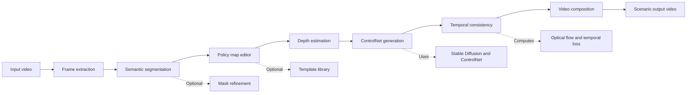

# Urban Mobility Scenario Generator
## Product Strategy & Roadmap

---

## Executive Summary

**Urban Mobility Scenario Generator** is an AI-powered platform that enables urban planners to visualize sustainable city futures in hours instead of months. Users upload street videos, draw policy interventions (bike lanes, EV stations, pedestrian zones), and the system generates photorealistic scenarios ready for stakeholder presentations.

---

## Architecture Diagram



---

## 1. PRODUCT VISION

### Vision Statement
> *"Enable urban planners to visualize sustainable city futures in hours, not months."*

### What We Do
- 📹 Upload street video footage
- 🎨 Draw policy interventions (bike lanes, EV stations, etc.)
- 🤖 AI generates photorealistic scenarios
- 📊 Export professional videos for presentations

### Target Users
- Urban planners & transportation engineers
- City governments & municipalities
- Architects & landscape designers
- NGOs & sustainability advocates
- Real estate developers
- Academic researchers

### Core Values
| Value | Meaning |
|-------|---------|
| **Authenticity** | Looks real, not synthetic |
| **Control** | User controls what changes |
| **Accessibility** | Non-technical friendly |
| **Speed** | Hours, not weeks |
| **Transparency** | Open-source, reproducible |

---

## 2. REQUIREMENT CLARITY

### MVP Requirements (Must-Have)
✅ Process 1-10 minute videos  
✅ Simple policy map drawing interface  
✅ Generate photorealistic output  
✅ Export 1080p video in <2 hours  
✅ Works on single GPU (<$500) or free cloud  
✅ Getting started guide  
✅ Academic paper published  

### Release 1.1 Requirements (Should-Have)
✅ Web UI (no command line)  
✅ Pre-built intervention templates  
✅ Quantitative quality metrics (LPIPS, FID)  
✅ Before/After comparison videos  
✅ Batch processing multiple scenarios  
✅ Google Colab free tier  
✅ Tutorial videos  

### Release 2.0 Requirements (Nice-to-Have)
✅ REST API for third-party integration  
✅ GIS software integration (Esri, ArcGIS)  
✅ SaaS cloud platform  
✅ Advanced analytics (equity scoring)  
✅ Mobile app support  

---

## 3. EARLY PRODUCT THINKING

### Go-to-Market Strategy

```
Phase 1: Credibility
    ↓
Publish Academic Paper (CVPR/ICCV/ECCV)
    ↓
Phase 2: Community
    ↓
Open-source on GitHub (Free)
    ↓
Phase 3: Accessibility
    ↓
Free Google Colab Notebook
    ↓
Phase 4: Validation
    ↓
City Pilot Programs (Case Studies)
    ↓
Phase 5: Monetization
    ↓
Commercial SaaS Offering
```

### Competitive Advantage

| Aspect | Traditional | Urban Mobility SG |
|--------|-------------|------------------|
| **Method** | Manual 3D modeling | AI-powered |
| **Control** | Fixed renderings | Policy-conditioned |
| **Realism** | Hand-drawn sketches | Photorealistic |
| **Speed** | Weeks/months | Hours |
| **Cost** | $10K+ workstations | $500 GPU / free cloud |

---

## 4. USER STORIES (Top 10)

### Story 1: Basic Scenario Generation
- **User:** Urban planner
- **Need:** Quickly see what a bike lane would look like
- **Done When:** Upload video → draw intervention → get output in <2 hours
- **Effort:** 5 points

### Story 2: Custom Policy Maps
- **User:** Design professional
- **Need:** Draw exactly where changes should happen
- **Done When:** Freehand drawing tool with undo/redo
- **Effort:** 8 points

### Story 3: Photorealistic Quality
- **User:** Stakeholder presenter
- **Need:** Output looks like real future, not synthetic
- **Done When:** ControlNet ensures coherent, realistic images
- **Effort:** 13 points

### Story 4: Smooth Videos
- **User:** Any user
- **Need:** No flickering between frames
- **Done When:** Temporal consistency score >0.8
- **Effort:** 13 points

### Story 5: Batch Processing
- **User:** Planner comparing alternatives
- **Need:** Process 5 scenarios at once
- **Done When:** CLI supports parallel jobs
- **Effort:** 8 points

### Story 6: Web Interface
- **User:** Non-technical city council member
- **Need:** Use web app, no installation
- **Done When:** Gradio interface with drag-drop upload
- **Effort:** 8 points

### Story 7: Quality Metrics
- **User:** Researcher
- **Need:** Quantitative proof system works
- **Done When:** LPIPS, FID, temporal scores displayed
- **Effort:** 8 points

### Story 8: Cloud Deployment
- **User:** User without GPU
- **Need:** Run on free Google Colab
- **Done When:** One-click Colab notebook
- **Effort:** 5 points

### Story 9: GIS Integration
- **User:** City GIS analyst
- **Need:** Import/export shapefile policy maps
- **Done When:** Shapefile import + export working
- **Effort:** 13 points

### Story 10: REST API
- **User:** Developer
- **Need:** Call system from other apps
- **Done When:** OpenAPI docs + Python/JS SDKs
- **Effort:** 13 points

---

## 5. PRODUCT BACKLOG

### Release 1.0 - MVP
**Timeline:** Q1 2026 (Jan-Mar) | **Goal:** Publish paper + launch open-source

| Feature | Priority | Effort | Status |
|---------|----------|--------|--------|
| ControlNet generation | MUST | 13 | In Progress |
| Policy map interface | MUST | 8 | In Progress |
| Temporal consistency | MUST | 13 | In Progress |
| Video input/output | MUST | 5 | In Progress |
| Documentation | MUST | 5 | Pending |
| Academic paper | MUST | 21 | In Progress |

**Total Effort:** 65 points | **Velocity:** 15 pts/month | **Timeline:** 4 months

---

### Release 1.1 - Professional
**Timeline:** Q2 2026 (Apr-Jun) | **Goal:** Production-ready web app + cloud

| Feature | Priority | Effort | Status |
|---------|----------|--------|--------|
| Gradio web UI | HIGH | 8 | Pending |
| Google Colab notebook | HIGH | 5 | Pending |
| Quality metrics | HIGH | 8 | Pending |
| Intervention templates | HIGH | 5 | Pending |
| Batch processing | HIGH | 8 | Pending |
| Tutorial videos | HIGH | 13 | Pending |

**Total Effort:** 57 points | **Timeline:** 3 months

---

### Release 2.0 - Enterprise
**Timeline:** Q3-Q4 2026 (Jul-Dec) | **Goal:** Commercial platform with integrations

| Feature | Priority | Effort | Status |
|---------|----------|--------|--------|
| REST API | HIGH | 13 | Backlog |
| GIS integration | MEDIUM | 13 | Backlog |
| SaaS deployment | HIGH | 21 | Backlog |
| Advanced analytics | MEDIUM | 8 | Backlog |
| Customer support | MEDIUM | 8 | Backlog |

**Total Effort:** 63 points | **Timeline:** 6 months

---

## 6. RELEASE PLAN & TIMELINE

### Development Roadmap

```
Q1 2026 (Jan-Mar)
├─ Weeks 1-4: Core ML Features
│  ├─ ControlNet integration
│  ├─ Temporal consistency losses
│  └─ Depth estimation (MiDaS)
├─ Weeks 4-8: Paper Writing & Experiments
│  ├─ Experiments on BDD100K
│  ├─ Ablation studies
│  └─ Paper submission
└─ Weeks 7-8: Release Preparation
   ├─ Code cleanup
   ├─ Documentation
   └─ v1.0 Release

Q2 2026 (Apr-Jun)
├─ Weeks 1-4: Web UI Development
│  ├─ Gradio interface
│  └─ Policy map editor
├─ Weeks 3-6: Cloud Infrastructure
│  ├─ Google Colab setup
│  └─ Docker containerization
├─ Weeks 4-7: Quality Metrics
│  ├─ LPIPS/FID implementation
│  └─ Dashboard development
└─ Weeks 7-12: Community Building
   ├─ Tutorial videos
   ├─ Case studies
   └─ v1.1 Release

Q3-Q4 2026 (Jul-Dec)
├─ Weeks 1-6: API Development
│  ├─ REST endpoints
│  └─ SDK generation
├─ Weeks 4-8: GIS Integration
│  ├─ Shapefile support
│  └─ ArcGIS plugin
├─ Weeks 8-12: SaaS Platform
│  ├─ Cloud deployment
│  ├─ Authentication
│  └─ Scaling
└─ Weeks 12-24: City Pilots
   ├─ Recruit 5 cities
   ├─ Deploy & support
   └─ v2.0 Release
```

---

### Key Milestones

#### Release 1.0 Milestones
| Date | Milestone | Owner | Status |
|------|-----------|-------|--------|
| Feb 15 | Paper submitted | Research Lead | In Progress |
| Mar 1 | Code frozen | ML Lead | Pending |
| Mar 15 | v1.0 released (GitHub) | PM | Pending |

**Success Criteria:** Paper accepted, >100 GitHub stars, <50 critical bugs

#### Release 1.1 Milestones
| Date | Milestone | Owner | Status |
|------|-----------|-------|--------|
| Apr 15 | Web UI functional | Frontend Lead | Pending |
| Apr 30 | Colab notebook ready | DevOps Lead | Pending |
| May 15 | Metrics implemented | ML Lead | Pending |
| Jun 1 | Tutorial videos complete | Documentation | Pending |
| Jun 15 | v1.1 released | PM | Pending |

**Success Criteria:** 500 GitHub stars, 1 city pilot, <2.5 hr processing

#### Release 2.0 Milestones
| Date | Milestone | Owner | Status |
|------|-----------|-------|--------|
| Aug 1 | API v1.0 complete | Backend Lead | Pending |
| Aug 31 | GIS integration done | Integration Eng | Pending |
| Oct 1 | SaaS platform live | DevOps Lead | Pending |
| Oct 31 | 5 city pilots recruited | Sales/BD | Pending |
| Dec 1 | v2.0 released | PM | Pending |

**Success Criteria:** 5+ customers, 10 concurrent jobs, 1000 GitHub stars

---

## 7. SUCCESS METRICS & OKRs

### Release 1.0 Success Metrics
- ✅ Paper accepted at T1 venue (CVPR/ICCV/ECCV)
- ✅ <50 critical bugs in first month
- ✅ >100 GitHub stars within 30 days
- ✅ Code reproducibility validated by 3+ external researchers
- ✅ Complete documentation & getting started guide

### Release 1.1 Success Metrics
- ✅ 90% Colab success rate (users successfully run notebook)
- ✅ 500 GitHub stars
- ✅ <2.5 hours average time from upload to output
- ✅ 1+ active city pilot
- ✅ >100 tutorial video views per video
- ✅ <20 unresolved GitHub issues

### Release 2.0 Success Metrics
- ✅ 5+ commercial customers active
- ✅ API: >95% endpoint documentation coverage
- ✅ SaaS: 10 concurrent jobs without degradation
- ✅ Case studies: 50% design iteration time reduction (proven)
- ✅ 1000+ GitHub stars
- ✅ 10+ published papers citing the work

---

## 8. TEAM & RESOURCE ALLOCATION

### Release 1.0 (3 months)
```
ML Engineers (2 FTE)          ████████████████████  80%
Backend Developer (1 FTE)     ████████████  60%
Research Lead (0.5 FTE)       ████████████████████  100%
Documentation (0.5 FTE)       ████████  40%
```

### Release 1.1 (3 months)
```
ML Engineers (1.5 FTE)        ████████████  60%
Backend Developer (1 FTE)     ████████████████  80%
Frontend Developer (1 FTE)    ████████████████████  100%
DevOps Engineer (0.5 FTE)     ████████  40%
Documentation (1 FTE)         ████████████████████  100%
Community Manager (0.5 FTE)   ████████  40%
```

### Release 2.0 (6 months)
```
Backend Developers (1.5 FTE)  ████████████████████  100%
Integration Engineer (1 FTE)  ████████████████  80%
DevOps Engineer (1 FTE)       ████████████████████  100%
Frontend Developer (0.5 FTE)  ████  20%
Sales/BD (0.5 FTE)            ████████████  60%
Support Specialist (0.5 FTE)  ████████████  60%
```

**Total Headcount Build-out:** 5-6 FTE by Q3 2026

---

## 9. RISKS & MITIGATION

| Risk | Likelihood | Impact | Mitigation |
|------|-----------|--------|-----------|
| Paper rejected from T1 venues | Medium | High | Submit to IJCV/IEEE TIP as backup; build community first |
| ControlNet too slow on consumer GPU | Medium | High | Optimize quantization; free Colab tier; model distillation |
| Team turnover (key ML engineer) | Low | High | Thorough code documentation; cross-training |
| BDD100K license/access issues | Low | Medium | Prepare KITTI + custom dataset alternatives |
| Feature creep & scope expansion | High | High | Strict backlog management; defer P2 features |
| Slow adoption of platform | Medium | Medium | Early city pilots; compelling case studies; marketing |

---

## 10. QUICK START CHECKLIST

### Right Now (Jan 2026)
- [ ] Finalize paper draft
- [ ] Set up GitHub repo (private)
- [ ] Write basic README

### Month 2 (Feb 2026)
- [ ] Paper submission to venue
- [ ] Code cleanup & documentation
- [ ] Prepare release v1.0

### Month 3-4 (Mar-Apr 2026)
- [ ] Launch v1.0 + GitHub public
- [ ] Build Google Colab notebook
- [ ] Start web UI development (Gradio)

### Month 5-6 (May-Jun 2026)
- [ ] Launch v1.1 + web UI
- [ ] Publish tutorial video series
- [ ] Recruit first city pilot

### Month 7-12 (Jul-Dec 2026)
- [ ] Build REST API & SDKs
- [ ] Implement GIS integrations
- [ ] Launch SaaS platform
- [ ] Manage city pilot deployments
- [ ] Release v2.0

---

## Contact & Next Steps

**Project Lead:** [Your Name]  
**GitHub:** [Repository URL]  
**Website:** [Coming soon]  
**Email:** [Contact Email]

### How to Contribute
1. Star ⭐ the GitHub repository
2. Fork and submit pull requests
3. Join community discussions
4. Report bugs and suggest features
5. Share case studies and results

---

**This is a realistic, achievable roadmap for turning research into a usable product for real urban planners.**

*Last Updated: January 30, 2026*
